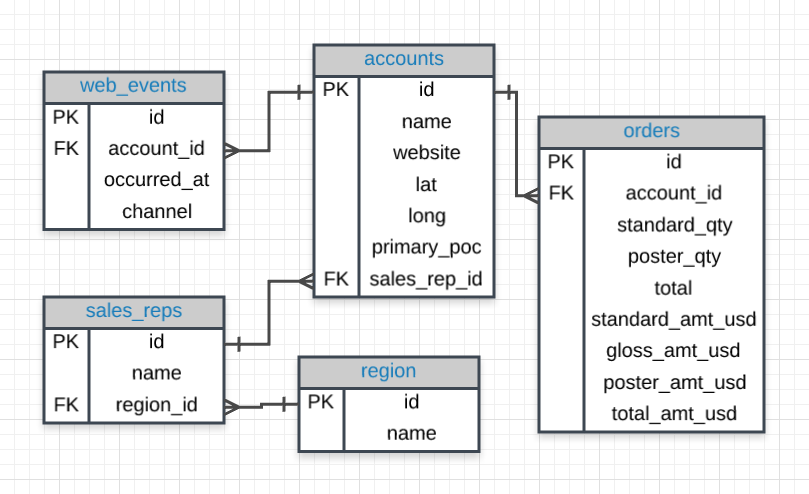
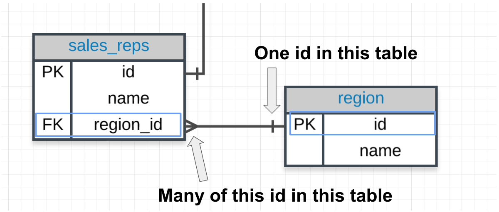
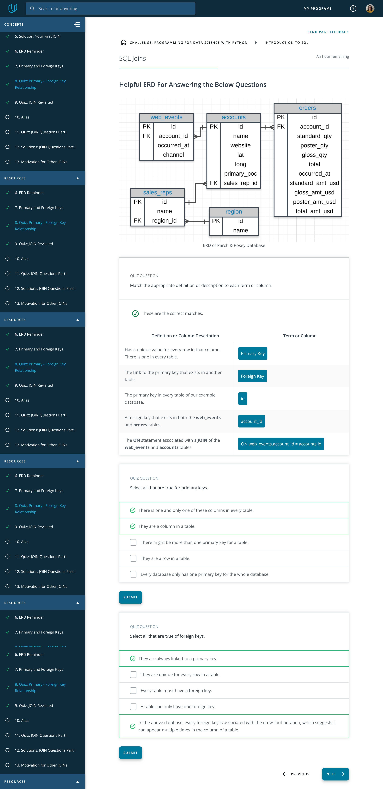
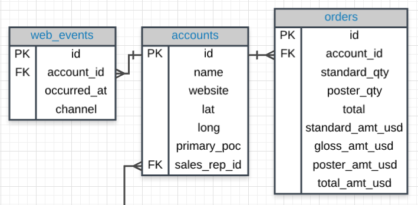
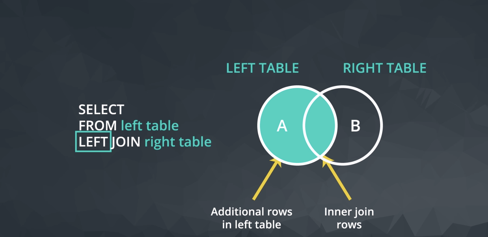
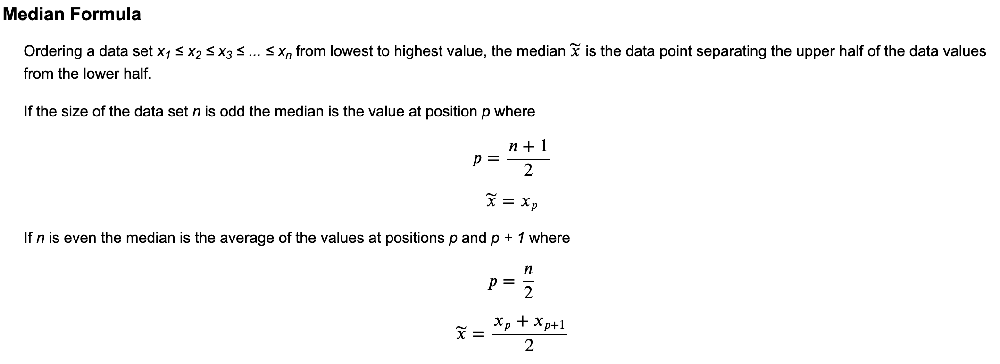
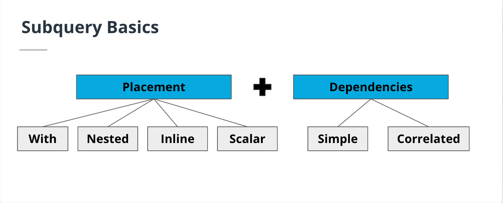
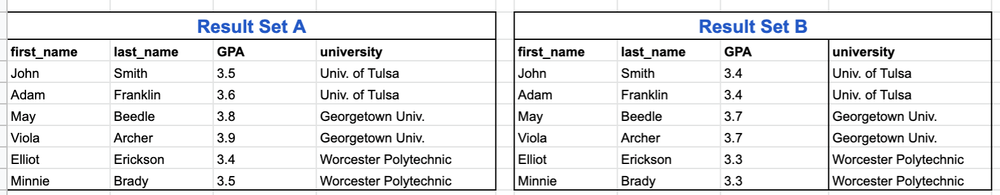

## Database Normalization

When creating a database, it is really important to think about how data will be stored. This is known as **normalization**, and it is a huge part of most SQL classes. If you are in charge of setting up a new database, it is important to have a thorough understanding of database normalization.

There are essentially three ideas that are aimed at database normalization:

* Are the tables storing logical groupings of the data?
* Can I make changes in a single location, rather than in many tables for the same information?
* Can I access and manipulate data quickly and efficiently?

This is discussed in detail [here](https://www.itprotoday.com/sql-server/sql-design-why-you-need-database-normalization).

## Introduction to JOINs

```sql
-- Inner Join --
SELECT orders.*,
       accounts.*
FROM orders 
JOIN accounts
ON orders.account_id = accounts.id;
```

The **SELECT** clause indicates which column(s) of data you'd like to see in the output (For Example, `orders.*` gives us all the columns in the orders table in the output). The **FROM** clause indicates the first table from which we're pulling data, and the **JOIN** indicates the second table. The **ON** clause specifies the column on which you'd like to merge the two tables together. 

```sql
-- pull individual elements from either the orders or accounts table --
SELECT accounts.name, orders.occurred_at
FROM orders
JOIN accounts
ON orders.account_id = accounts.id;
```

The below query pulls all the columns from both the accounts and orders table.

```sql
SELECT *
FROM orders
JOIN accounts
ON orders.account_id = accounts.id;
```

## Entity Relationship Diagrams

An **entity-relationship diagram (ERD)** is a common way to view data in a database. It is also a key element to understanding how we can pull data from multiple tables.

It will be beneficial to have an idea of what the ERD looks like for Parch & Posey.



## Keys

### Primary Key (PK)

A **primary key** is a unique column in a particular table. This is the first column in each of our tables. Here, those columns are all called id, but that doesn't necessarily have to be the name. **It is common that the primary key is the first column in our tables in most databases**.

### Foreign Key (FK)

A **foreign key** is a column in one table that is a primary key in a different table. We can see in the Parch & Posey ERD that the foreign keys are:

1. region_id
2. account_id
3. sales_rep_id

Each of these is linked to the primary key of another table. An example is shown in the image below:



## Primary - Foreign Key Link

In the above image you can see that:

1. The **region_id** is the foreign key.
2. The region_id is **linked** to id - this is the primary-foreign key link that connects these two tables.
3. The crow's foot shows that the **FK** can actually appear in many rows in the **sales_reps** table.
4. While the single line is telling us that the **PK** shows that id appears only once per row in this table.



## JOIN More than Two Tables

Look at the three tables below.



The code below pulls all of the data from all of the joined tables.

```sql
-- Alternatively you could also use the following SELECT statement to query specific columns
-- SELECT web_events.channel, accounts.name, orders.total --
SELECT *
FROM web_events
JOIN accounts
ON web_events.account_id = accounts.id
JOIN orders
ON accounts.id = orders.account_id
```

our **JOIN** holds a table, and **ON** is a link for our **PK** to equal the **FK**.

## Alias

We can simply write our alias directly after the column name (in the **SELECT**) or table name (in the **FROM** or **JOIN**) by writing the alias directly following the column or table we would like to alias. This will allow you to create clear column names even if calculations are used to create the column, and you can be more efficient with your code by aliasing table names.

Before, you saw something like:

Examples:

```sql
SELECT o.*, a.*
FROM orders o
JOIN accounts a
ON o.account_id = a.id
```

```sql
SELECT col1 + col2 AS total, col3
```

Frequently, you might also see these statements without the **AS** statement and they would still produce the **exact same results**:

```sql
SELECT col1 + col2 total, col3
```

## Aliases for Columns in Resulting Table

While aliasing tables is the most common use case. It can also be used to alias the columns selected to have the resulting table reflect a more readable name.

Example:

```sql
Select t1.column1 aliasname, t2.column2 aliasname2
FROM tablename AS t1
JOIN tablename2 AS t2
```

> If you have two or more columns in your SELECT that have the same name after the table name such as accounts.name and sales_reps.name you will need to alias them. Otherwise it will only show one of the columns. You can alias them like accounts.name AS AcountName, sales_rep.name AS SalesRepName

## QUESTIONS

1. Provide a table for all **web_events** associated with the account **name** of `Walmart`. There should be three columns. Be sure to include the `primary_poc`, time of the event, and the `channel` for each event. Additionally, you might choose to add a fourth column to assure only `Walmart` events were chosen.

```sql
SELECT we.occurred_at, we.channel, ac.primary_poc, ac.name
FROM web_events we
JOIN accounts ac
ON we.account_id = ac.id
WHERE ac.name = 'Walmart'
```

2. Provide a table that provides the **region** for each **sales_rep** along with their associated **accounts**. Your final table should include three columns: the region **name**, the sales rep **name**, and the account **name**. Sort the accounts alphabetically (A-Z) according to the account name.

```sql
SELECT re.name AS region_name, sr.name AS sales_rep_name, ac.name AS acc_name
FROM sales_reps sr
JOIN region re 
ON sr.region_id = re.id
JOIN accounts ac
ON ac.sales_rep_id = sr.id
ORDER BY ac.name
```

3. Provide the **name** for each region for every **order**, as well as the account **name** and the **unit price** they paid (total_amt_usd/total) for the order. Your final table should have 3 columns: **region name**, **account name**, and **unit price**. A few accounts have 0 for **total**, so I divided by (total + 0.01) to assure not dividing by zero.

```sql
SELECT re.name AS region_name, ac.name AS acc_name, od.total_amt_usd/(od.total+0.01) AS unit_price
FROM sales_reps sr
JOIN region re 
ON sr.region_id = re.id
JOIN accounts ac
ON ac.sales_rep_id = sr.id
JOIN orders od
ON od.account_id = ac.id
```

## OTHER TYPE OF JOINS



Notice each of these new **JOIN** statements pulls all the same rows as an **INNER JOIN**, which you saw by just using **JOIN**, but they also potentially pull some additional rows.

If there is not matching information in the **JOIN**ed table, then you will have columns with empty cells. These empty cells introduce a new data type called **NULL**.

**LEFT JOIN**
```sql
SELECT a.id, a.name, o.total
FROM orders o
LEFT JOIN accounts a
ON o.account_id = a.id
```

**RIGHT JOIN**
```sql
SELECT a.id, a.name, o.total
FROM orders o
RIGHT JOIN accounts a
ON o.a
```

### Quick Note

You might see the SQL syntax of

`LEFT OUTER JOIN`

OR

`RIGHT OUTER JOIN`

These are the exact same commands as the **LEFT JOIN** and **RIGHT JOIN** 

### OUTER JOINS

The last type of join is a full outer join. This will return the inner join result set, as well as any unmatched rows from either of the two tables being joined.

Again this returns rows that **do not match** one another from the two tables. The use cases for a full outer join are **very rare**.

Similar to the above, you might see the language **FULL OUTER JOIN**, which is the same as **OUTER JOIN**.


## JOINs and Filtering

```sql
SELECT orders.*, accounts.*
FROM orders
LEFT JOIN accounts
ON orders.account_id = accounts.id 
AND accounts.sales_rep_id = 321500
```

A simple rule to remember is that, when the database executes this query, it executes the join and everything in the **ON** clause first. Think of this as building the new result set. 

## QUESTIONS

1. Provide a table that provides the **region** for each **sales_rep** along with their associated **accounts**. This time only for the `Midwest` region. Your final table should include three columns: the region **name**, the sales rep **name**, and the account **name**. Sort the accounts alphabetically (A-Z) according to the account name.

```sql
SELECT re.name AS region_name, sr.name AS sales_rep_name, ac.name AS acc_name
FROM sales_reps sr
JOIN region re
ON sr.region_id = re.id
JOIN accounts ac
ON ac.sales_rep_id = sr.id
AND re.name = 'Midwest'
ORDER BY ac.name
```

2. Provide a table that provides the **region** for each **sales_rep** along with their associated **accounts**. This time only for accounts where the sales rep has a first name starting with `S` and in the `Midwest` region. Your final table should include three columns: the region **name**, the sales rep **name**, and the account **name**. Sort the accounts alphabetically (A-Z) according to the account name.

```sql
SELECT re.name AS region_name, sr.name AS sales_rep_name, ac.name AS acc_name
FROM sales_reps sr
JOIN region re
ON sr.region_id = re.id
JOIN accounts ac
ON ac.sales_rep_id = sr.id
AND sr.name LIKE 'S%'
AND re.name = 'Midwest'
ORDER BY ac.name
```

3. Provide a table that provides the **region** for each **sales_rep** along with their associated **accounts**. This time only for accounts where the sales rep has a **last** name starting with `K` and in the `Midwest` region. Your final table should include three columns: the region **name**, the sales rep **name**, and the account **name**. Sort the accounts alphabetically (A-Z) according to the account name.

```sql
SELECT re.name AS region_name, sr.name AS sales_rep_name, ac.name AS acc_name
FROM sales_reps sr
JOIN region re
ON sr.region_id = re.id
JOIN accounts ac
ON ac.sales_rep_id = sr.id
AND sr.name LIKE '% K%'
AND re.name = 'Midwest'
ORDER BY ac.name
```

4. Provide the **name** for each region for every **order**, as well as the account **name** and the **unit price** they paid (total_amt_usd/total) for the order. However, you should only provide the results if the **standard order quantity** exceeds `100`. Your final table should have 3 columns: **region name**, **account name**, and **unit price**. In order to avoid a division by zero error, adding .01 to the denominator here is helpful total_amt_usd/(total+0.01).

```sql
SELECT re.name AS region_name, ac.name AS acc_name, od.total_amt_usd/(od.total + 0.01) AS unit_price
FROM sales_reps sr
JOIN region re
ON sr.region_id = re.id
JOIN accounts ac
ON ac.sales_rep_id = sr.id
JOIN orders od
ON od.account_id = ac.id
AND od.standard_qty > 100
```

5. Provide the **name** for each region for every order, as well as the account name and the unit price they paid (total_amt_usd/total) for the order. However, you should only provide the results if the standard order quantity exceeds 100 and the poster order quantity exceeds 50. Your final table should have 3 columns: region name, account name, and unit price. Sort for the smallest unit price first. In order to avoid a division by zero error, adding .01 to the denominator here is helpful (total_amt_usd/(total+0.01).

```sql
SELECT re.name AS region_name, ac.name AS acc_name, od.total_amt_usd/(od.total + 0.01) AS unit_price
FROM sales_reps sr
JOIN region re
ON sr.region_id = re.id
JOIN accounts ac
ON ac.sales_rep_id = sr.id
JOIN orders od
ON od.account_id = ac.id
AND od.standard_qty > 100
AND od.poster_qty > 50
ORDER BY unit_price
```

6. Provide the name for each region for every **order**, as well as the account **name** and the **unit price** they paid (total_amt_usd/total) for the order. However, you should only provide the results if the **standard order quantity** exceeds `100` and the **poster order quantity** exceeds `50`. Your final table should have 3 columns: **region name**, **account name**, and **unit price**. Sort for the largest **unit price** first. In order to avoid a division by zero error, adding .01 to the denominator here is helpful (total_amt_usd/(total+0.01).

```sql
SELECT re.name AS region_name, ac.name AS acc_name, od.total_amt_usd/(od.total + 0.01) AS unit_price
FROM sales_reps sr
JOIN region re
ON sr.region_id = re.id
JOIN accounts ac
ON ac.sales_rep_id = sr.id
JOIN orders od
ON od.account_id = ac.id
AND od.standard_qty > 100
AND od.poster_qty > 50
ORDER BY unit_price DESC
```

7. What are the different **channels** used by **account id** `1001`? Your final table should have only 2 columns: **account name** and the different **channels**. You can try **SELECT DISTINCT** to narrow down the results to only the unique values.

```sql
SELECT DISTINCT we.channel, ac.name AS acc_name
FROM web_events we
JOIN accounts ac
ON we.account_id = ac.id
AND ac.id = '1001'
```

8. Find all the orders that occurred in `2015`. Your final table should have 4 columns: **occurred_at**, **account name**, **order total**, and order **total_amt_usd**.

```sql
SELECT o.occurred_at, a.name, o.total, o.total_amt_usd
FROM accounts a
JOIN orders o
ON o.account_id = a.id
WHERE o.occurred_at BETWEEN '01-01-2015' AND '01-01-2016'
ORDER BY o.occurred_at DESC;
```

You will notice that using **BETWEEN** is tricky for dates! While **BETWEEN** is generally inclusive of endpoints, it assumes the time is at 00:00:00 (i.e. midnight) for dates. This is the reason why we set the right-side endpoint of the period at '01-01-2016'.

## RECAP

There are a few more advanced JOINs that we did not cover here, and they are used in very specific use cases. [UNION and UNION ALL](https://www.w3schools.com/sql/sql_union.asp), [CROSS JOIN](http://www.w3resource.com/sql/joins/cross-join.php), and the tricky [SELF JOIN](https://www.w3schools.com/sql/sql_join_self.asp). These are more advanced than this course will cover, but it is useful to be aware that they exist, as they are useful in special cases.

## BETWEEN Operator

Sometimes we can make a cleaner statement using **BETWEEN** than we can use **AND**. Particularly this is true when we are using the same column for different parts of our **AND** statement. In the previous video, we probably should have used **BETWEEN**.

Instead of writing :

`WHERE column >= 6 AND column <= 10`

we can instead write, equivalently:

`WHERE column BETWEEN 6 AND 10`

## SQL Aggregations

- Deal with NULL values
- Create aggregations in your SQL Queries including
    * COUNT
    * SUM
    * MIN & MAX
    * AVG
    * GROUP BY
    * DISTINCT
    * HAVING
- Create DATE functions
- Implement CASE statements

## NULLs and Aggregation

**NULLs** are a datatype that specifies where no data exists in SQL. 

You need to write `IS NULL` instead of `= NULL`, that's because `NULL` is not a value, but a **property** of the data.

## NULLs - Expert Tip

There are two common ways in which you are likely to encounter **NULL**s:

* **NULL**s frequently occur when performing a **LEFT** or **RIGHT JOIN**. When some rows in the left table of a left join are not matched with rows in the right table, those rows will contain some **NULL** values in the result set.
* **NULL**s can also occur from simply missing data in our database.

## First Aggregation - COUNT

### COUNT the Number of Rows in a Table

Finding all the rows in the b table.

```sql
SELECT COUNT(*)
FROM accounts;
```

But we could have just as easily chosen a column to drop into the aggregation function:

```sql
SELECT COUNT(accounts.id)
FROM accounts;
```

These two statements are equivalent, but this isn't always the case.

Other examples:

```sql
SELECT COUNT(*)
FROM orders
WHERE occurred_at >= '2016-12-01'
AND occurred_at < '2017-01-01'
```

Using alias

```sql
SELECT COUNT(*) AS order_count
FROM orders
WHERE occurred_at >= '2016-12-01'
AND occurred_at < '2017-01-01'
```

```sql
SELECT COUNT (*) AS account_count
FROM accounts
```

```sql
SELECT COUNT (id) AS account_id_count
FROM accounts
```

```sql
SELECT COUNT(primary_poc) AS account_primary_poc_count
FROM accounts
```

Notice that **COUNT** does not consider rows that have **NULL** values. Therefore, this can be useful for quickly identifying which rows have missing data. 

## SUM

Unlike **COUNT**, you can only use **SUM** on numeric columns. However, **SUM** will ignore **NULL** values, as do the other aggregation functions

```sql
SELECT SUM(standard_qty) AS standard,
       SUM(gloss_qty) AS gloss,
       SUM(poster_qty) AS poster
FROM orders
```

### Aggregation Reminder

An important thing to remember: **aggregators only aggregate vertically - the values of a column**. If you want to perform a calculation across rows, you would do this with **simple arithmetic**(aggregate across rows).


1. Find the total amount of **poster_qty** paper ordered in the **orders** table.

```sql
SELECT SUM(poster_qty) AS total_poster_sales
FROM orders
```

2. Find the total amount of **standard_qty** paper ordered in the **orders** table.

```sql
SELECT SUM(standard_qty) AS total_standard_sales
FROM orders
```

3. Find the total dollar amount of sales using the **total_amt_usd** in the **orders** table.

```sql
SELECT SUM(total_amt_usd) AS total_dollar_sales
FROM orders
```

4. Find the total amount spent on **standard_amt_usd** and **gloss_amt_usd** paper for each order in the orders table This should give a dollar amount for **each** order in the table.

```sql
SELECT standard_amt_usd + gloss_amt_usd AS total_standard_gloss
FROM orders;
```

5. Find the **standard_amt_usd** per unit of **standard_qty** paper. Your solution should use both aggregation and a mathematical operator.

```sql
SELECT SUM(standard_amt_usd)/SUM(standard_qty) AS standard_price_per_unit
FROM orders;
```

## MIN & MAX

### Expert Tip

Functionally, **MIN** and **MAX** are similar to **COUNT** in that they can be used on non-numerical columns. Depending on the column type, **MIN** will return the lowest number, earliest date, or non-numerical value as early in the alphabet as possible. As you might suspect, **MAX** does the opposite—it returns the highest number, the latest date, or the non-numerical value closest alphabetically to “Z.”

```sql
SELECT MIN(standard_qty) AS standard_min,
       MIN(gloss_qty) AS gloss_min,
       MIN(poster_qty) AS poster_min,
       MAX(standard_qty) AS standard_max,
       MAX(gloss_qty) AS gloss_max,
       MAX(poster_qty) AS poster_max
FROM
```

## AVG

Similar to other software **AVG** returns the mean of the data - that is the sum of all of the values in the column divided by the number of values in a column. This aggregate function again ignores the **NULL** values in both the numerator and the denominator.

If you want to count **NULL**s as zero, you will need to use **SUM** and **COUNT**. However, this is probably not a good idea if the **NULL** values truly just represent unknown values for a cell.

### MEDIAN - Expert Tip

One quick note that a median might be a more appropriate measure of center for this data, but finding the median happens to be a pretty difficult thing to get using SQL alone — so difficult that finding a median is occasionally asked as an interview question.

```sql
SELECT AVG(standard_qty) AS standard_avg,
       AVG(gloss_qty) AS gloss_avg,
       AVG(poster_qty) AS poster_avg
FROM orders
```

### Questions: MIN, MAX, & AVERAGE

1. When was the earliest order ever placed? You only need to return the date.

```sql
SELECT MIN(occurred_at) AS earliest_order
FROM orders
```

2. Try performing the same query as in question 1 without using an aggregation function.

```sql
SELECT occurred_at
FROM orders
ORDER BY occurred_at
LIMIT 1
```

3. When did the most recent (latest) **web_event** occur?

```sql
SELECT MAX(occurred_at) AS latest_web_event
FROM web_events
```

4. Try to perform the result of the previous query without using an aggregation function.

```sql
SELECT occurred_at
FROM web_events
ORDER BY occurred_at DESC
LIMIT 1 
```

5. Find the mean (**AVERAGE**) amount spent per order on each paper type, as well as the mean amount of each paper type purchased per order. Your final answer should have 6 values - one for each paper type for the average number of sales, as well as the average amount.

```sql
SELECT AVG(standard_qty) mean_standard, 
       AVG(gloss_qty) mean_gloss, 
       AVG(poster_qty) mean_poster, 
       AVG(standard_amt_usd) mean_standard_usd, 
       AVG(gloss_amt_usd) mean_gloss_usd, 
       AVG(poster_amt_usd) mean_poster_usd
FROM orders;
```

6. Via the video, you might be interested in how to calculate the MEDIAN. Though this is more advanced than what we have covered so far try finding - what is the MEDIAN **total_usd** spent on all **orders**?



```sql
-- we can hard code a solution in the following way.--
SELECT *
FROM (SELECT total_amt_usd
   FROM orders
   ORDER BY total_amt_usd
   LIMIT 3457) AS Table1
ORDER BY total_amt_usd DESC
LIMIT 2;
```

even better:

```sql
SELECT AVG(total_amt_usd)
FROM (
        SELECT *
        FROM (
            SELECT total_amt_usd
            FROM orders
            ORDER BY total_amt_usd
            LIMIT 3457
            ) AS FirstHalf
        ORDER BY total_amt_usd DESC
        LIMIT 2
    ) AS Table2
```

Since there are 6912 orders - we want the average of the 3457 and 3456 order amounts when ordered. This is the average of 2483.16 and **2482.55**. This gives the median of 2482.855. This obviously isn't an ideal way to compute. If we obtain new orders, we would have to change the limit. SQL didn't even calculate the median for us. The above used a SUBQUERY, but you could use any method to find the two necessary values, and then you just need the average of them.

## GROUP BY

The key takeaways here:

* **GROUP BY** can be used to aggregate data within subsets of the data. For example, grouping for different accounts, different regions, or different sales representatives.
* Any column in the **SELECT** statement that is not within an aggregator must be in the **GROUP BY** clause.
* The **GROUP BY** always goes between **WHERE** and **ORDER BY**.

### GROUP BY - Expert Tip

```sql
SELECT account_id,
       SUM(standard_qty) AS standard,
       SUM(gloss_qty) AS gloss,
       SUM(poster_qty) AS poster
FROM orders
GROUP BY account_id
ORDER BY account_id
```

Before we dive deeper into aggregations using **GROUP BY** statements, it is worth noting that SQL evaluates the aggregations before the **LIMIT** clause. If you don’t group by any columns, you’ll get a 1-row result—no problem there. If you group by a column with enough unique values that it exceeds the **LIMIT** number, the aggregates will be calculated, and then some rows will simply be omitted from the results.

This is actually a nice way to do things because you know you’re going to get the correct aggregates. If SQL cuts the table down to 100 rows, then performed the aggregations, your results would be substantially different.

### Questions: GROUP BY

One part that can be difficult to recognize is when it might be easiest to use an aggregate or one of the other SQL functionalities. Try some of the below to see if you can differentiate to find the easiest solution.

1. Which **account** (by name) placed the earliest order? Your solution should have the **account name** and the **date** of the order.

```sql
SELECT ac.name, od.occurred_at
FROM accounts AS ac
JOIN orders AS od
ON ac.id = od.account_id
ORDER BY od.occurred_at
LIMIT 1
```

2. Find the total sales in **usd** for each account. You should include two columns - the total sales for each company's orders in **usd** and the company **name**.

```sql
SELECT ac.name, SUM(od.total_amt_usd) AS total_sales
FROM accounts AS ac
JOIN orders AS od
ON ac.id = od.account_id
GROUP BY ac.name
```

3. Via what **channel** did the most recent (latest) **web_event** occur, which **account** was associated with this **web_event**? Your query should return only three values - the **date**, **channel**, and **account name.**

```sql
SELECT we.channel, ac.name, we.occurred_at
FROM web_events AS we
JOIN accounts AS ac
ON ac.id = we.account_id
ORDER BY we.occurred_at DESC
LIMIT 1
```


4. Find the total number of times each type of **channel** from the **web_events** was used. Your final table should have two columns - the **channel** and the number of times the channel was used.

```sql
SELECT we.channel, COUNT(*)
FROM web_events AS we
GROUP BY we.channel
```

5. Who was the **primary contact** associated with the earliest **web_event**?

```sql
SELECT ac.primary_poc, we.occurred_at
FROM web_events AS we
JOIN accounts AS ac
ON ac.id = we.account_id
ORDER BY we.occurred_at
LIMIT 1
```

6. What was the smallest order placed by each **account** in terms of **total usd**. Provide only two columns - the account **name** and the **total usd**. Order from smallest dollar amounts to largest.

```sql
SELECT ac.name, MIN(od.total_amt_usd) as smallest_order
FROM accounts AS ac
JOIN orders AS od
ON ac.id = od.account_id
GROUP BY ac.name
ORDER BY smallest_order
-- Sort of strange we have a bunch of orders with no dollars. We might want to look into those.--
```

7. Find the number of **sales reps** in each region. Your final table should have two columns - the **region** and the number of **sales_reps**. Order from the fewest reps to most reps.

```sql
SELECT re.name, COUNT(sr) AS num_sales_rep
FROM sales_reps AS sr
JOIN region AS re
ON re.id = sr.region_id
GROUP BY re.name
ORDER BY num_sales_rep
```

## GROUP BY - Multiple Columns

```sql
SELECT account_id,
       channel,
       COUNT(id) as events
FROM web_events
GROUP BY account_id, channel
ORDER BY account_id, channel DESC
```

* You can **GROUP BY** multiple columns at once, as we showed here. This is often useful to aggregate across a number of different segments.
* The order of columns listed in the **ORDER BY** clause does make a difference. You are ordering the columns from left to right.

### GROUP BY - Expert Tips

* The order of column names in your **GROUP BY** clause doesn’t matter—the results will be the same regardless. If we run the same query and reverse the order in the **GROUP BY** clause, you can see we get the same results.
* As with **ORDER BY**, you can substitute numbers for column names in the **GROUP BY** clause. It’s generally recommended to do this only when you’re grouping many columns, or if something else is causing the text in the GROUP BY clause to be excessively long.

### Questions: GROUP BY Part II

1. For each account, determine the average amount of each type of paper they purchased across their orders. Your result should have four columns - one for the account name and one for the average quantity purchased for each of the paper types for each account.

```sql
SELECT ac.name, AVG(od.standard_qty) AS avg_stand_qty, AVG(od.poster_qty) AS avg_post_qty, AVG(od.gloss_qty) AS avg_gloss_qty
FROM accounts AS ac
JOIN orders AS od
ON ac.id = od.account_id
GROUP BY ac.name
```

2. For each account, determine the average amount spent per order on each paper type. Your result should have four columns - one for the account name and one for the average amount spent on each paper type.

```sql
SELECT ac.name, AVG(od.standard_amt_usd) AS avg_standard_amt_usd, AVG(od.poster_amt_usd) AS avg_poster_amt_usd, AVG(od.gloss_amt_usd) AS avg_gloss_amt_usd
FROM accounts AS ac
JOIN orders AS od
ON ac.id = od.account_id
GROUP BY ac.name
```

3. Determine the number of times a particular channel was used in the web_events table for each sales rep. Your final table should have three columns - the name of the sales rep, the channel, and the number of occurrences. Order your table with the highest number of occurrences first.

```sql
SELECT sr.name, we.channel, COUNT(*) web_events_occurrences
FROM web_events AS we
JOIN accounts AS ac
ON ac.id = we.account_id
JOIN sales_reps AS sr
ON sr.id = ac.sales_rep_id
GROUP BY sr.name, we.channel
ORDER BY web_events_occurrences DESC
```

4. Determine the number of times a particular channel was used in the web_events table for each region. Your final table should have three columns - the region name, the channel, and the number of occurrences. Order your table with the highest number of occurrences first.

```sql
SELECT re.name, we.channel, COUNT(*) web_events_occurrences
FROM web_events AS we
JOIN accounts AS ac
ON ac.id = we.account_id
JOIN sales_reps AS sr
ON sr.id = ac.sales_rep_id
JOIN region AS re
ON re.id = sr.region_id
GROUP BY re.name, we.channel
ORDER BY web_events_occurrences DESC
```

## DISTINCT

**DISTINCT** is always used in **SELECT** statements, and it provides the unique rows for all columns written in the **SELECT** statement. Therefore, you only use **DISTINCT** once in any particular **SELECT** statement.

You could write:

```sql
SELECT DISTINCT column1, column2, column3
FROM table1;
```

which would return the unique (or **DISTINCT**) rows across all three columns.

You would **not** write:

```sql
SELECT DISTINCT column1, DISTINCT column2, DISTINCT column3
FROM table1;
```

You can think of **DISTINCT** the same way you might think of the statement "unique".

### DISTINCT - Expert Tip

It’s worth noting that using **DISTINCT**, particularly in aggregations, can slow your queries down quite a bit.

```sql
SELECT DISTINCT account_id,
       channel
FROM web_events
ORDER BY account_id
```

### Questions: DISTINCT

1. Use DISTINCT to test if there are any accounts associated with more than one region.

> The below two queries have the same number of resulting rows (351), so we know that every account is associated with only one region. If each account was associated with more than one region, the first query should have returned more rows than the second query.

```sql
SELECT a.id as "account id", a.name as "account name",  
r.id as "region id", r.name as "region name"
FROM accounts a
JOIN sales_reps s
ON s.id = a.sales_rep_id
JOIN region r
ON r.id = s.region_id
ORDER BY "account id", "account name"
```

and

```sql
SELECT DISTINCT id, name
FROM accounts;
```

2. Have any sales reps worked on more than one account?

> Actually, all of the sales reps have worked on more than one account. The fewest number of accounts any sales rep works on is 3. There are 50 sales reps, and they all have more than one account. Using DISTINCT in the second query assures that all of the sales reps are accounted for in the first query.

```sql
SELECT s.id, s.name, COUNT(*) num_accounts
FROM accounts a
JOIN sales_reps s
ON s.id = a.sales_rep_id
GROUP BY s.id, s.name
ORDER BY num_accounts;
```
and

```sql
SELECT DISTINCT id, name
FROM sales_reps;
```
## HAVING

```sql
SELECT account_id,
       SUM(total_amt_usd) AS sum_total_amt_usd
FROM orders
GROUP BY 1
HAVING SUM(total_amt_usd) >= 250000
```

### HAVING - Expert Tip

**HAVING** is the “clean” way to filter a query that has been aggregated, but this is also commonly done using a [subquery](https://mode.com/sql-tutorial/sql-sub-queries/). Essentially, any time you want to perform a **WHERE** on an element of your query that was created by an aggregate, you need to use **HAVING** instead.

* **WHERE** subsets the returned data based on a logical condition.
* **WHERE**  appears after the **FROM**, **JOIN** and **ON**  clauses, but before **GROUP BY**
* **HAVING** appears after the **GROUP BY** clause, but before the **ORDER BY** clause
* **HAVING** is like **WHERE**, but it works on logical statements involving aggregations.  

## Questions: HAVING

1. How many of the **sales reps** have more than 5 accounts that they manage?

```sql
SELECT sr.id, sr.name, COUNT(*) AS num_accounts
FROM accounts ac
JOIN sales_reps sr
ON sr.id = ac.sales_rep_id
GROUP BY sr.id, sr.name
HAVING COUNT(*) > 5
ORDER BY num_accounts
```

2. How many **accounts** have more than 20 orders?

```sql
SELECT ac.id, ac.name, COUNT(*) AS num_orders
FROM accounts AS ac
JOIN orders AS od
ON ac.id = od.account_id
GROUP BY ac.id, ac.name
HAVING COUNT(*) > 20
ORDER BY num_orders
```

3. Which account has the most orders?

```sql
SELECT ac.id, ac.name, COUNT(*) AS num_orders
FROM accounts AS ac
JOIN orders AS od
ON ac.id = od.account_id
GROUP BY ac.id, ac.name
ORDER BY num_orders DESC
LIMIT 1
```

4. Which accounts spent more than 30,000 usd total across all orders?

```sql
SELECT ac.id, ac.name, SUM(od.total_amt_usd) AS usd_total_across_orders
FROM accounts AS ac
JOIN orders AS od
ON ac.id = od.account_id
GROUP BY ac.id, ac.name
HAVING SUM(od.total_amt_usd) > 30000
ORDER BY usd_total_across_orders
```

5. Which accounts spent less than 1,000 usd total across all orders?

```sql
SELECT ac.id, ac.name, SUM(od.total_amt_usd) AS usd_total_across_orders
FROM accounts AS ac
JOIN orders AS od
ON ac.id = od.account_id
GROUP BY ac.id, ac.name
HAVING SUM(od.total_amt_usd) < 1000
ORDER BY usd_total_across_orders
```

6. Which account has spent the most with us?

```sql
SELECT ac.id, ac.name, SUM(od.total_amt_usd) AS usd_total_across_orders
FROM accounts AS ac
JOIN orders AS od
ON ac.id = od.account_id
GROUP BY ac.id, ac.name
ORDER BY usd_total_across_orders DESC
LIMIT 1
```

7. Which account has spent the least with us?

```sql
SELECT ac.id, ac.name, SUM(od.total_amt_usd) AS usd_total_across_orders
FROM accounts AS ac
JOIN orders AS od
ON ac.id = od.account_id
GROUP BY ac.id, ac.name
ORDER BY usd_total_across_orders
LIMIT 1
```

8. Which accounts used **facebook** as a **channel** to contact customers more than 6 times?

```sql
SELECT ac.id, ac.name, we.channel, COUNT(*) AS facebook_channel_usage
FROM web_events we
JOIN accounts ac
ON we.account_id = ac.id 
AND we.channel = 'facebook'
GROUP BY ac.id, ac.name, we.channel
HAVING COUNT(*) > 6
ORDER BY facebook_channel_usage
```

```sql
SELECT a.id, a.name, w.channel, COUNT(*) use_of_channel
FROM accounts a
JOIN web_events w
ON a.id = w.account_id
GROUP BY a.id, a.name, w.channel
HAVING COUNT(*) > 6 AND w.channel = 'facebook'
ORDER BY use_of_channel;
```

9. Which account used **facebook** most as a **channel**?

```sql
SELECT ac.id, ac.name, we.channel, COUNT(*) AS facebook_channel_usage
FROM web_events we
JOIN accounts ac
ON we.account_id = ac.id 
AND we.channel = 'facebook'
GROUP BY ac.id, ac.name, we.channel
ORDER BY facebook_channel_usage DESC
LIMIT 1
```

_Note_: This query above only works if there are no ties for the account that used facebook the most. It is a best practice to use a larger limit number first such as 3 or 5 to see if there are ties before using LIMIT 1.

10. Which channel was most frequently used by most accounts?

```sql
SELECT ac.id, ac.name, we.channel, COUNT(*) AS most_used_channel
FROM web_events we
JOIN accounts ac
ON we.account_id = ac.id 
GROUP BY ac.id, ac.name, we.channel
ORDER BY most_used_channel DESC
LIMIT 1
```

## DATE Functions

**GROUP**ing **BY** a date column is not usually very useful in SQL, as these columns tend to have transaction data down to a second. Keeping date information at such granular levels is both a blessing and a curse, as it gives really precise information (a blessing), but it makes grouping information together directly difficult (a curse).

Lucky for us, there are a number of built-in SQL functions that are aimed at helping us improve our experience in working with dates.

**DATE_TRUNC** allows you to truncate your date to a particular part of your date-time column. Common truncations are `day`, `month`, and `year`. [Here](https://blog.modeanalytics.com/date-trunc-sql-timestamp-function-count-on/) is a great blog post by Mode Analytics on the power of this function.

**DATE_PART** can be useful for pulling a specific portion of a date, but notice pulling month or day of the week (dow) means that you are no longer keeping the years in order. Rather you are grouping for certain components regardless of which year they belonged in.

For additional functions you can use with dates, check out the documentation [here](https://www.postgresql.org/docs/9.1/functions-datetime.html), but the **DATE_TRUNC** and **DATE_PART** functions definitely give you a great start!

You can reference the columns in your select statement in GROUP BY and ORDER BY clauses with numbers that follow the order they appear in the select statement. For example

```sql
SELECT standard_qty, COUNT(*)
FROM orders
GROUP BY 1 --(this 1 refers to standard_qty since it is the first of the columns included in the select statement)
ORDER BY 1 --(this 1 refers to standard_qty since it is the first of the columns included in the select statement)
```

```sql
SELECT DATE_TRUNC('day', occurred_at) AS day,
        SUM(standard_qty) AS standard_qty_sum
FROM demo.orders
GROUP BY DATE_TRUNC('day', occurred_at)
ORDER BY DATE_TRUNC('day', occurred_at)
```

```sql
SELECT DATE_PART('dow',occurred_at) AS day_of_week,
       SUM(total) AS total_qty
FROM orders
GROUP BY 1
ORDER BY 2
```

## Questions: Working With DATEs

1. Find the sales in terms of total dollars for all orders in each `year`, ordered from greatest to least. Do you notice any trends in the yearly sales totals?

```sql
SELECT DATE_TRUNC('year', occurred_at), SUM(total_amt_usd) total_dollars_per_year
FROM orders
GROUP BY 1
ORDER BY 2 DESC
```

```sql
SELECT DATE_PART('year', occurred_at) ord_year,  SUM(total_amt_usd) total_spent
FROM orders
GROUP BY 1
ORDER BY 2 DESC;
```

> When we look at the yearly totals, you might notice that 2013 and 2017 have much smaller totals than all other years. If we look further at the monthly data, we see that for 2013 and 2017 there is only one month of sales for each of these years (12 for 2013 and 1 for 2017). Therefore, neither of these is evenly represented. Sales have been increasing year over year, with 2016 being the largest sales to date. At this rate, we might expect 2017 to have the largest sales.

2. Which **month** did Parch & Posey have the greatest sales in terms of total dollars? Are all months evenly represented by the dataset?

```sql
SELECT EXTRACT(MONTH FROM occurred_at), SUM(total_amt_usd) total_dollars_per_year
FROM orders
GROUP BY 1
ORDER BY 2 DESC
```

> In order for this to be 'fair', we should remove the sales from 2013 and 2017. For the same reasons as discussed above.

```sql
SELECT DATE_PART('month', occurred_at) ord_month, SUM(total_amt_usd) total_spent
FROM orders
WHERE occurred_at BETWEEN '2014-01-01' AND '2017-01-01'
GROUP BY 1
ORDER BY 2 DESC; 
```

3. Which **year** did Parch & Posey have the greatest sales in terms of the total number of orders? Are all years evenly represented by the dataset?

```sql
SELECT DATE_TRUNC('year', occurred_at), SUM(total) total_orders_per_year
FROM orders
GROUP BY 1
ORDER BY 2 DESC
```
> Again, 2016 by far has the most amount of orders, but again 2013 and 2017 are not evenly represented to the other years in the dataset.

```sql
SELECT DATE_PART('year', occurred_at) ord_year,  COUNT(*) total_sales
FROM orders
GROUP BY 1
ORDER BY 2 DESC;
```

4. Which **month** did Parch & Posey have the greatest sales in terms of the total number of orders? Are all months evenly represented by the dataset?

> December still has the most sales, but interestingly, November has the second most sales (but not the most dollar sales. To make a fair comparison from one month to another 2017 and 2013 data were removed.

```sql
SELECT EXTRACT(MONTH FROM occurred_at), COUNT(*) total_dollars_per_year
FROM orders 
WHERE occurred_at BETWEEN '2014-01-01' AND '2017-01-01'
GROUP BY 1
ORDER BY 2 DESC
```

5. In which **month** of which **year** did `Walmart` spend the most on gloss paper in terms of dollars?

```sql
SELECT DATE_TRUNC('month', od.occurred_at), SUM(od.gloss_amt_usd) total_orders_per_year
FROM accounts AS ac
JOIN orders AS od
ON ac.id = od.account_id AND ac.name = 'Walmart'
GROUP BY 1
ORDER BY 2 DESC
LIMIT 1
--2016-05
```

## CASE Statements

### CASE - Expert Tip

* The CASE statement always goes in the SELECT clause.
* CASE must include the following components: WHEN, THEN, and END. ELSE is an optional component to catch cases that didn’t meet any of the other previous CASE conditions.
* You can make any conditional statement using any conditional operator (like WHERE) between WHEN and THEN. This includes stringing together multiple conditional statements using AND and OR.
* You can include multiple WHEN statements, as well as an ELSE statement again, to deal with any unaddressed conditions.

### Examples

let's use a **CASE** statement. This way any time the **standard_qty** is zero, we will return 0, and otherwise, we will return the **unit_price**.

```sql
SELECT account_id, 
CASE WHEN standard_qty = 0 OR standard_qty IS NULL THEN 0
     ELSE standard_amt_usd/standard_qty END AS unit_price
FROM orders
LIMIT 10;
```

Now the first part of the statement will catch any of those **divisions by zero** values that were causing the error, and the other components will compute the division as necessary. You will notice, we essentially charge all of our accounts 4.99 for standard paper. It makes sense this doesn't fluctuate, and it is more accurate than adding 1 in the denominator like our quick fix might have been in the earlier lesson.

```sql
SELECT id,
       account_id,
       occurred_at,
       channel,
       CASE WHEN channel = 'facebook' THEN 'yes' END AS is_facebook
FROM web_events
ORDER BY occurred_at
```

```sql
SELECT id,
       account_id,
       occurred_at,
       channel,
       CASE WHEN channel = 'facebook' THEN 'yes' ELSE 'no' END AS is_facebook
FROM web_events
ORDER BY occurred_at
```

```sql
SELECT id,
       account_id,
       occurred_at,
       channel,
       CASE WHEN channel = 'facebook' OR channel = 'direct' THEN 'yes' 
       ELSE 'no' END AS is_facebook
FROM web_events
ORDER BY occurred_at
```

> Avoid overlapping ranges, like the one below
```sql
SELECT account_id,
       occurred_at,
       total,
       CASE WHEN total > 500 THEN 'Over 500'
            WHEN total > 300 THEN '301 - 500'
            WHEN total > 100 THEN '101 - 300'
            ELSE '100 or under' END AS total_group
FROM orders
```

```sql
SELECT account_id,
       occurred_at,
       total,
       CASE WHEN total > 500 THEN 'Over 500'
            WHEN total > 300 AND total <= 500 THEN '301 - 500'
            WHEN total > 100 AND total <=300 THEN '101 - 300'
            ELSE '100 or under' END AS total_group
FROM orders
```

There are some advantages to separating data into separate columns like this depending on what you want to do, but often this level of separation might be easier to do in another programming language - rather than with SQL.

```sql
SELECT CASE WHEN total > 500 THEN 'OVer 500'
            ELSE '500 or under' END AS total_group,
            COUNT(*) AS order_count
FROM orders
GROUP BY 1
```

### Questions: CASE

1. Write a query to display for each order, the account ID, the total amount of the order, and the level of the order - ‘Large’ or ’Small’ - depending on if the order is $3000 or more, or smaller than $3000.

```sql
SELECT account_id,
       id,
       total_amt_usd,
       CASE WHEN total_amt_usd >= 3000 THEN 'Larger'
            ELSE 'Small' END AS order_level
FROM orders
```

2. Write a query to display the number of orders in each of three categories, based on the `total` number of items in each order. The three categories are: 'At Least 2000', 'Between 1000 and 2000' and 'Less than 1000'.


```sql
SELECT CASE WHEN total >= 2000 THEN 'At Least 2000'
            WHEN total >= 1000 AND total < 2000 THEN 'Between 1000 and 2000'
            ELSE 'Less than 1000' END AS order_category,
            COUNT(*) AS order_count
FROM orders
GROUP BY 1
```

3. We would like to understand 3 different levels of customers based on the amount associated with their purchases. The top-level includes anyone with a Lifetime Value (total sales of all orders) `greater than 200,000 usd`. The second level is between `200,000 and 100,000` usd. The lowest level is anyone `under 100,000` usd. Provide a table that includes the **level** associated with each **account**. You should provide the **account name**, the **total sales of all orders** for the customer, and the **level**. Order with the top spending customers listed first.

```sql
SELECT ac.name, SUM(od.total_amt_usd) AS total_sales
       CASE WHEN SUM(od.total_amt_usd) > 200000 THEN 'top'
            WHEN SUM(od.total_amt_usd) >= 100000 AND SUM(od.total_amt_usd) <= 200000 THEN 'middle'
            ELSE 'low' END AS customer_level, 
FROM orders AS od
JOIN accounts AS ac
ON od.account_id = ac.id
GROUP BY 1
ORDER BY 2 DESC
```

4. We would now like to perform a similar calculation to the first, but we want to obtain the total amount spent by customers only in `2016` and `2017`. Keep the same **levels** as in the previous question. Order with the top spending customers listed first.

```sql
SELECT ac.name,
       od.occurred_at,
       SUM(od.total_amt_usd) AS total_sales,
       CASE WHEN SUM(od.total_amt_usd) > 200000 THEN 'top'
            WHEN SUM(od.total_amt_usd) >= 100000 AND SUM(od.total_amt_usd) <= 200000 THEN 'middle'
            ELSE 'low' END AS customer_level
FROM orders AS od
JOIN accounts AS ac
ON od.account_id = ac.id
AND od.occurred_at BETWEEN '2016-01-01' AND '2018-01-01'
GROUP BY 1, 2
ORDER BY 3 DESC
```

5. We would like to identify top-performing **sales reps**, which are sales reps associated with more than 200 orders. Create a table with the **sales rep name**, the total number of orders, and a column with `top` or `not` depending on if they have more than 200 orders. Place the top salespeople first in your final table.

```sql
SELECT sr.name, 
       CASE WHEN COUNT(*) > 200 THEN 'top'
       ELSE 'not' END AS total_number_of_orders,
       COUNT(*) AS top_sales
FROM sales_reps sr
JOIN accounts ac
ON ac.sales_rep_id = sr.id
JOIN orders od
ON od.account_id = ac.id
GROUP BY sr.id, sr.name
ORDER BY top_sales DESC
```

6. The previous didn't account for the middle, nor the dollar amount associated with the sales. Management decides they want to see these characteristics represented as well. We would like to identify top-performing **sales reps**, which are sales reps associated with more than `200` orders or more than `750000` in total sales. The `middle` group has any **rep** with more than 150 orders or `500000` in sales. Create a table with the **sales rep name**, the total number of orders, total sales across all orders, and a column with `top`, `middle`, or `low` depending on these criteria. Place the top salespeople based on the dollar amount of sales first in your final table. You might see a few upset salespeople by this criteria!

```sql
SELECT sr.name, 
       CASE WHEN COUNT(*) > 200 OR SUM(od.total_amt_usd) > 750000  THEN 'top'
            WHEN COUNT(*) BETWEEN 150 AND 200 OR SUM(od.total_amt_usd) BETWEEN 500000 AND 750000 THEN 'middle'
            ELSE 'not' END AS salespeople_level,
       COUNT(*) AS total_number_of_orders,
       SUM(od.total_amt_usd) AS total_sales_across_orders
FROM sales_reps sr
JOIN accounts ac
ON ac.sales_rep_id = sr.id
JOIN orders od
ON od.account_id = ac.id AND od.occurred_at BETWEEN '2016-01-01' AND '2018-01-01'
GROUP BY sr.id, sr.name
ORDER BY total_sales_across_orders DESC
```

## SQL Subqueries & Temporary Tables

```sql
SELECT product_id,
       name,
       price
FROM db.product
Where price > (SELECT AVG(price)
              FROM db.product)
```

### When do you need to use a subquery?

You need to use a subquery when you have the need to manipulate an existing table to “pseudo-create” a table that is then used as a part of a larger query. In the examples below, existing tables cannot be joined together to solve the problem at hand. Instead, an existing table needs to be manipulated, massaged, or aggregated in some way to then join to another table in the dataset to answer the posed question.

#### Set of Problems:

1. Identify the top-selling Amazon products in months where sales have exceeded $1m
* _Existing Table_: Amazon daily sales
* _Subquery Aggregation_: Daily to Monthly

2. Examine the average price of a brand’s products for the highest-grossing brands
* _Existing Table_: Product pricing data across all retailers
* _Subquery Aggregation_: Individual to Average

3.Order the annual salary of employees that are working less than 150 hours a month
* _Existing Table_: Daily time-table of employees
* _Subquery Aggregation_: Daily to Monthly

## Subqueries vs. Joins

### Use Cases:

_Subquery_: When an existing table needs to be manipulated or aggregated to then be joined to a larger table.

_Joins_: A fully flexible and discretionary use case where a user wants to bring two or more tables together and select and filter as needed.

### Dependencies:

_Subquery_: A subquery clause can be run completely independently. When trying to debug code, subqueries are often run independently to pressure test results before running the larger query.

_Joins_: A join clause cannot stand and be run independently.

### Subquery vs Joins Overview

Components	| Subquery	| JOINS
------------|-----------|-----------------------------------------
Combine data from multiple tables into a single result | x | x
Create a flexible view of tables stitched together using a “key” | | x
Build an output to use in a later part of the query	| x	| 
Subquery Plan: What happens under the hood | x | x

## Subquery Basics

### Fundamentals to Know about Subqueries:

* Subqueries must be fully placed inside parentheses.
* Subqueries must be fully independent and can be executed on their own
* Subqueries have two components to consider:
    * Where it’s placed
    * Dependencies with the outer/larger query

**A caveat with subqueries being independent:**

In almost all cases, subqueries are fully independent. They are "interim”/temp tables that can be fully executed on their own. **However, there is an exception**. When a subquery, typically in the form of a nested or inline subquery, is correlated to its outer query, it cannot run independently. This is most certainly an edge case since correlated subqueries are rarely implemented compared to standalone, simple subqueries.

### Subquery Basics



### Placement:

There are four places where subqueries can be inserted within a larger query:

* With
* Nested
* Inline
* Scalar

### Dependencies:

A subquery can be **dependent** on the outer query or **independent** of the outer query.

### Resources:

The following resources on subqueries covers use cases, syntax, and examples. It's from Microsoft and can be found [here](https://docs.microsoft.com/en-us/sql/relational-databases/performance/subqueries?view=sql-server-ver15).

### Subqueries: Placement

Before writing any code, a strong SQL user considers what problem he or she is trying to solve, where the subquery needs to be placed, and larger tradeoffs (e.g., readability).

The key concept of placement is where exactly the subquery is placed within the context of the larger query. There are four different places where a subquery can be inserted. From my experience, the decision of which placement to leverage stems from (1) the problem at hand and (2) the readability of the query.

* **With**: This subquery is used when you’d like to “pseudo-create” a table from an existing table and **visually scope** the temporary table at the top of the larger query.

```sql
WITH subquery_name (column_name1, ...) AS
 (SELECT ...)
SELECT ...
```

* **Nested**: This subquery is used when you’d like the temporary table to act as a filter within the larger query, which implies that it often sits within the **where clause**.

```sql
SELECT s.s_id, s.s_name, g.final_grade
FROM student s, grades g
WHERE s.s_id = g.s_id
IN (SELECT final_grade
    FROM grades g
    WHERE final_grade > 3.7
   );
```

```sql
SELECT *
FROM orders
WHERE DATE_TRUNC('month',occurred_at) =
 (SELECT DATE_TRUNC('month',MIN(occurred_at)) AS min_month
  FROM orders)
ORDER BY occurred_at
```

#### Expert Tip

> Note that you should not include an alias when you write a subquery in a conditional statement. This is because the subquery is treated as an individual value (or set of values in the **IN** case) rather than as a table. **Nested and Scalar subqueries often do not require aliases the way With and Inline subqueries do**.

The above query works because the result of the subquery is only one cell. Most conditional logic will work with subqueries containing once-cell results. But **IN** is the only type of conditional logic that will work when the inner query container multiple results.


* **Inline**: This subquery is used in the same fashion as the **WITH** use case above. However, instead of the temporary table sitting on top of the larger query, it’s embedded within the **from clause**.

```sql
SELECT student_name
FROM
  (SELECT student_id, student_name, grade
   FROM student
   WHERE teacher = 10)
WHERE grade > 80;
```

* **Scalar**: This subquery is used when you’d like to generate a scalar value to be used as a benchmark of some sort.


```sql
SELECT s.student_name
  (SELECT AVG(final_score)
   FROM grades g
   WHERE g.student_id = s.student_id) AS
     avg_score
FROM student s;
```

For example, when you’d like to calculate the average salary across an entire organization to compare to individual employee salaries. Because it’s often a single value that is generated and used as a benchmark, the scalar subquery often sits within the **select clause**.


#### Advantages:

**Readability**: `With` and `Nested` subqueries are most advantageous for readability.

**Performance**: `Scalar` subqueries are advantageous for performance and are often used on smaller datasets.

### Hands-on Practice

We would like to know which channels send the most traffic per day on average to Parch and Posey

```sql
SELECT channel,
       AVG(event_count) AS avg_event_count
FROM
(SELECT DATE_TRUNC('day',occurred_at) AS day,
        channel,
        count(*) as event_count
   FROM web_events
   GROUP BY 1,2
   ) sub
   GROUP BY 1
   ORDER BY 2 DESC
```

You’ll notice the following order of operations.

1. **Build the Subquery**: The aggregation of an existing table that you’d like to leverage as a part of the larger query.
2. **Run the Subquery**: Because a subquery can stand independently, it’s important to run its content first to get a sense of whether this aggregation is the interim output you are expecting.
3. **Encapsulate and Name**: Close this subquery off with parentheses and call it something. In this case, we called the subquery table ‘sub.’
4. **Test Again**: Run a `SELECT *` within the larger query to determine if all syntax of the subquery is good to go.
5. **Build Outer Query**: Develop the `SELECT *` clause as you see fit to solve the problem at hand, leveraging the subquery appropriately.

### Subquery Formatting

The first concept that helps when thinking about the format of a subquery is the placement of it: `with`, `nested`, `inline`, or `scalar.`

The second concept to consider is an indentation, which helps heighten readability for your future self or other users that want to leverage your code. In general, be thinking about how to write your queries in a readable way. 


### Subqueries Practice

1. The average amount of standard paper sold on the first month that any order was placed in the **orders** table (in terms of quantity).

2. The average amount of gloss paper sold on the first month that any order was placed in the **orders** table (in terms of quantity).

3. The average amount of poster paper sold on the first month that any order was placed in the **orders** table (in terms of quantity).

```sql
SELECT AVG(standard_qty) avg_std, AVG(gloss_qty) avg_gls, AVG(poster_qty) avg_pst
FROM orders
WHERE DATE_TRUNC('month', occurred_at) = 
     (SELECT DATE_TRUNC('month', MIN(occurred_at)) FROM orders);
```

> OBS: You need to use aliases for the average aboves, otherwise it will only get the value of the last one.

4. The total amount spent on all orders on the first month that any order was placed in the **orders** table (in terms of usd).

```sql
SELECT SUM(total_amt_usd)
FROM orders
WHERE DATE_TRUNC('month', occurred_at) = 
      (SELECT DATE_TRUNC('month', MIN(occurred_at)) FROM orders);
```

### Subqueries: Dependencies

**Simple Subquery**: The inner subquery is completely independent of the larger query.

```sql
WITH dept_average AS 
  (SELECT dept, AVG(salary) AS avg_dept_salary
   FROM employee
   GROUP BY employee.dept
  )
SELECT E.eid, E.ename, D.avg_dept_salary
FROM employee E
JOIN dept.average D
ON E.dept = D.dept
WHERE E.salary > D.avg_dept_salary
```

**Correlated Subquery**: The inner subquery is dependent on the larger query.

```sql
SELECT employee_id,
       name
FROM employees_db emp
WHERE salary > 
      (SELECT AVG(salary)
       FROM employees_db
       WHERE department = emp.department
      );
```

The second concept to consider before writing any code is the dependency of your subquery to the larger query. A subquery can either be simple or correlated. It’s better to keep subqueries simple to increase readability for other users that might leverage your code to run or adjust.

## When to use Correlated Query

However, sometimes, it’s slick to include a correlated subquery, specifically when the value of the inner query is dependent on a value outputted from the main query (e.g., the filter statement _constantly changes_). In the example below, you’ll notice that the value of the inner query -- average GPA -- keeps adjusting depending on the university the student goes to. THAT is a great use case for the correlated subquery.

```sql
SELECT first_name, last_name, GPA, university
 FROM student_db outer_db
 WHERE GPA >
                (SELECT AVG(GPA)
                 FROM student_db
                 WHERE university = outer_db.university);
```

## Quiz Time

Try the following quiz to full grasp the difference between the output of a Simple and Correlated Query. Use the image  below for the quiz at the end of the page.



Subquery 1. **[Result Set B]**

```sql
SELECT first_name, last_name, (
                 SELECT AVG(GPA)
                 FROM outer_db
                 WHERE university = outer_db.university) GPA, university
 FROM student_db outer_db;
```
Subquery 2. **[Result Set A]**

```sql
SELECT first_name, last_name, GPA, university
 FROM student_db outer_db
 WHERE GPA >
                (SELECT AVG(GPA)
                 FROM student_db
                 WHERE university = outer_db.university);
```

## Views in SQL

### Need for Views

Assume you run a complex query to fetch data from multiple tables. Now, you’d like to query again on the top of the result set. And later, you’d like to query more on the same result set returned earlier. So, there arises a need to store the result set of the original query, so that you can re-query it multiple times. This necessity can be fulfilled with the help of _views_.

### Understanding Views

Tables in SQL reside in the database persistently. In contrast, **views** are the _virtual_ tables that are derived from one or more base tables. The term _virtual_ means that the views do not exist physically in a database, instead, they reside in the memory (not database), just like the result of any query is stored in the memory.

The syntax for creating a view is

```sql
CREATE VIEW <VIEW_NAME>
AS
SELECT …
FROM …
WHERE …
```

The query above is called a view-definition. Once created, **you can query a view just like you’d query a normal table**, by using its name. The tuples in a view are created as an outcome of a SQL query that selects the filtered data from one or more tables. Let’s see a few examples below.

#### Examples

**Example 1** - Consider the same **Parch & Posey** database schema again, where the `sales_reps` table contains details about sales representatives and the `region` table contains the list of regions.

> Suppose you are managing sales representatives who are looking after the accounts in the Northeast region only. The details of such a subset of sales representatives can be fetched from two tables, and stored as a view:

```sql
create view v1
as
select S.id, S.name as Rep_Name, R.name as Region_Name
from sales_reps S
join region R
on S.region_id = R.id
and R.name = 'Northeast';
```

The query above will store the result as a view (virtual table) with the name “V1” that can be queried later.

**Example 2** - Consider another example from **Parch & Posey** database schema again, where you have practiced the following query in the “Joins” lesson:

> Provide the name for each region for every order, as well as the account name and the unit price they paid (total_amt_usd/total) for the order. Your final result should have 3 columns: region name, account name, and unit price.

The query would be

```sql
CREATE VIEW V2
AS
SELECT r.name region, a.name account, 
       o.total_amt_usd/(o.total + 0.01) unit_price
FROM region r
JOIN sales_reps s
ON s.region_id = r.id
JOIN accounts a
ON a.sales_rep_id = s.id
JOIN orders o
ON o.account_id = a.id;
```

You can save the result set of the query as a view (virtual table) with the name “V2” that can be queried later.

> **Note** - You can use any SELECT query in the CREATE VIEW query. The above two examples show a join query, whereas the next example shows a subquery used in creating a view.

**Example 3** - The subquery you saw earlier, can be also stored as a view.

Show the report which channels send the most traffic per day on average to Parch and Posey.

```sql
CREATE VIEW V3
AS
SELECT channel, AVG(events) AS average_events
FROM (SELECT DATE_TRUNC('day',occurred_at) AS day,
                channel, COUNT(*) as events
         FROM web_events 
         GROUP BY 1,2) sub
GROUP BY channel
```

Now, this view can be queried for any information that it contains. For example, you can see the maximum value of `average_events` as:

```sql
select max(average_events)
from v3;
```

### Points to Remember

**Can we update the base tables by updating a view?**

Since views do not exist physically in the database, it is may or may not be possible to execute UPDATE operations on views. It depends on the SELECT query used in the view definition. Generally, if the SELECT statement contains either an AGGREGATE function, GROUPING, or JOIN, then the view may not update the underlying base tables.

**Can we insert or delete a tuple in the base table by inserting or deleting a tuple in a view?**

Again, it depends on the view definition. If a view is created from a single base table, then yes, you can insert/delete tuples by doing so in the view.

**Can we alter the view definition?**

Most of the databases allow you to alter a view. For example, Oracle and IBM DB2 allows us to alter views and provides `CREATE OR REPLACE VIEW` option to redefine a view.

### Subquery Example: Challenge

* **What is the top channel used by each account to market products?**
* **How often was that same channel used?**

#### Solution

We will need to do two **aggregations and two** subqueries to make this happen.

1. Let's find the number of times each channel is used by each account.
2. So we will need to count the number of rows by Account and Channel. This count will be our **first aggregation** needed.

```sql
-- first aggregation --
SELECT a.id, a.name, we.channel, COUNT(*) ct
FROM accounts a
JOIN web_events we
ON a.id = we.account_id
GROUP BY a.id, a.name, we.channel
ORDER BY a.id;
```

3. Ok, now we have how often each channel was used by each account. _How do we only return the most used account (or accounts if multiple are tied for the most)_?

We need to see which usage of the channel in our first query is equal to the maximum usage channel for that account. So, a keyword should jump out to you - **maximum**. This will be our **second aggregation** and it utilizes the data from the first table we returned so this will be our **subquery**. Let's take the maximum count from each account to create a table with the maximum usage channel amount per account.


```sql
SELECT t1.id, t1.name, MAX(ct)
FROM (SELECT a.id, a.name, we.channel, COUNT(*) ct
     FROM accounts a
     JOIN web_events we
     On a.id = we.account_id
     GROUP BY a.id, a.name, we.channel) T1
GROUP BY t1.id, t1.name
```

4. So now we have the MAX usage number for a channel for each account. Now we can use this to filter the original table to find channels for each account that match the MAX amount for their account.

```sql
SELECT t3.id, t3.name, t3.channel, t3.ct
FROM (SELECT a.id, a.name, we.channel, COUNT(*) ct
     FROM accounts a
     JOIN web_events we
     On a.id = we.account_id
     GROUP BY a.id, a.name, we.channel) T3
JOIN (SELECT t1.id, t1.name, MAX(ct) max_chan
      FROM (SELECT a.id, a.name, we.channel, COUNT(*) ct
            FROM accounts a
            JOIN web_events we
            ON a.id = we.account_id
            GROUP BY a.id, a.name, we.channel) t1
      GROUP BY t1.id, t1.name) t2
ON t2.id = t3.id AND t2.max_chan = t3.ct
ORDER BY t3.id;
```


### More Subqueries Quizzes

1. Provide the **name** of the **sales_rep** in each **region** with the largest amount of **total_amt_usd** sales.

```sql
SELECT t3.rep_name, t3.region_name, t3.total_amt
FROM(SELECT region_name, MAX(total_amt) total_amt
     FROM(SELECT s.name rep_name, r.name region_name, SUM(o.total_amt_usd) total_amt
             FROM sales_reps s
             JOIN accounts a
             ON a.sales_rep_id = s.id
             JOIN orders o
             ON o.account_id = a.id
             JOIN region r
             ON r.id = s.region_id
             GROUP BY 1, 2) t1
     GROUP BY 1) t2
JOIN (SELECT s.name rep_name, r.name region_name, SUM(o.total_amt_usd) total_amt
     FROM sales_reps s
     JOIN accounts a
     ON a.sales_rep_id = s.id
     JOIN orders o
     ON o.account_id = a.id
     JOIN region r
     ON r.id = s.region_id
     GROUP BY 1,2
     ORDER BY 3 DESC) t3
ON t3.region_name = t2.region_name AND t3.total_amt = t2.total_amt;
```

2. For the region with the largest (sum) of sales **total_amt_usd**, how many **order_total_count** (count) orders were placed?

```sql
SELECT t1.name, t1.order_total_count
FROM(SELECT r.id, r.name, COUNT(*) order_total_count
             FROM sales_reps s
             JOIN accounts a
             ON a.sales_rep_id = s.id
             JOIN orders o
             ON o.account_id = a.id
             JOIN region r
             ON r.id = s.region_id
             GROUP BY 1, 2) t1
JOIN (SELECT r.id, r.name region_name, SUM(o.total_amt_usd) total_amt
     FROM sales_reps s
     JOIN accounts a
     ON a.sales_rep_id = s.id
     JOIN orders o
     ON o.account_id = a.id
     JOIN region r
     ON r.id = s.region_id
     GROUP BY 1,2) t2
ON t1.id = t2.id
ORDER BY 2 DESC
LIMIT 1
```

Alternative Solution

```sql
SELECT r.name, COUNT(o.total) total_orders
FROM sales_reps s
JOIN accounts a
ON a.sales_rep_id = s.id
JOIN orders o
ON o.account_id = a.id
JOIN region r
ON r.id = s.region_id
GROUP BY r.name
HAVING SUM(o.total_amt_usd) = (
      SELECT MAX(total_amt)
      FROM (SELECT r.name region_name, SUM(o.total_amt_usd) total_amt
              FROM sales_reps s
              JOIN accounts a
              ON a.sales_rep_id = s.id
              JOIN orders o
              ON o.account_id = a.id
              JOIN region r
              ON r.id = s.region_id
              GROUP BY r.name) sub);
```

3. **How many accounts** had more **total** purchases than the account **name** which has bought the most **standard_qty** paper throughout their lifetime as a customer?

First, we want to find the account that had the most **standard_qty** paper. The query here pulls that account, as well as the total amount:

```sql
SELECT a.name account_name, SUM(o.standard_qty) total_std, SUM(o.total) total
FROM accounts a
JOIN orders o
ON o.account_id = a.id
GROUP BY 1
ORDER BY 2 DESC
LIMIT 1;
```

Now, I want to use this to pull all the accounts with more total sales:

```sql
SELECT a.name
FROM orders o
JOIN accounts a
ON a.id = o.account_id
GROUP BY 1
HAVING SUM(o.total) > (SELECT total 
                   FROM (SELECT a.name act_name, SUM(o.standard_qty) tot_std, SUM(o.total) total
                         FROM accounts a
                         JOIN orders o
                         ON o.account_id = a.id
                         GROUP BY 1
                         ORDER BY 2 DESC
                         LIMIT 1) sub);
```

This is now a list of all the accounts with more total orders. We can get the count with just another simple subquery.

```sql
SELECT COUNT(*)
FROM (SELECT a.name
       FROM orders o
       JOIN accounts a
       ON a.id = o.account_id
       GROUP BY 1
       HAVING SUM(o.total) > (SELECT total 
                   FROM (SELECT a.name act_name, SUM(o.standard_qty) tot_std, SUM(o.total) total
                         FROM accounts a
                         JOIN orders o
                         ON o.account_id = a.id
                         GROUP BY 1
                         ORDER BY 2 DESC
                         LIMIT 1) inner_tab)
             ) counter_tab;
```


4. For the customer that spent the most (in total over their lifetime as a customer) **total_amt_usd**, how many **web_events** did they have for each channel?

Here, we first want to pull the customer with the most spent in lifetime value.

```sql
SELECT a.id, a.name, SUM(o.total_amt_usd) tot_spent
FROM orders o
JOIN accounts a
ON a.id = o.account_id
GROUP BY a.id, a.name
ORDER BY 3 DESC
LIMIT 1;
```

Now, we want to look at the number of events on each channel this company had, which we can match with just the **id**.

```sql
SELECT a.name, w.channel, COUNT(*)
FROM accounts a
JOIN web_events w
ON a.id = w.account_id AND a.id =  (SELECT id
                     FROM (SELECT a.id, a.name, SUM(o.total_amt_usd) tot_spent
                           FROM orders o
                           JOIN accounts a
                           ON a.id = o.account_id
                           GROUP BY a.id, a.name
                           ORDER BY 3 DESC
                           LIMIT 1) inner_table)
GROUP BY 1, 2
ORDER BY 3 DESC;
```

I added an **ORDER BY** for no real reason, and the account name to assure I was only pulling from one account.

**Alternative Solution (MINE)**

```sql
SELECT a.name, we.channel, COUNT(*)
FROM accounts a
JOIN web_events we
ON we.account_id = a.id
JOIN (SELECT a.id acc_id, SUM(o.total_amt_usd) total_amt
    FROM accounts a
    JOIN orders o
    ON o.account_id = a.id
    GROUP BY 1
    ORDER BY 2 DESC
    LIMIT 1) inner_tab
ON inner_tab.acc_id = a.id
GROUP BY 1, 2
ORDER BY 3 DESC;
```

5. What is the lifetime average amount spent in terms of **total_amt_usd** for the top 10 total spending **accounts**?

```sql

```

6. What is the lifetime average amount spent in terms of **total_amt_usd**, including only the companies that spent more per order, on average, than the average of all orders?

```sql
```